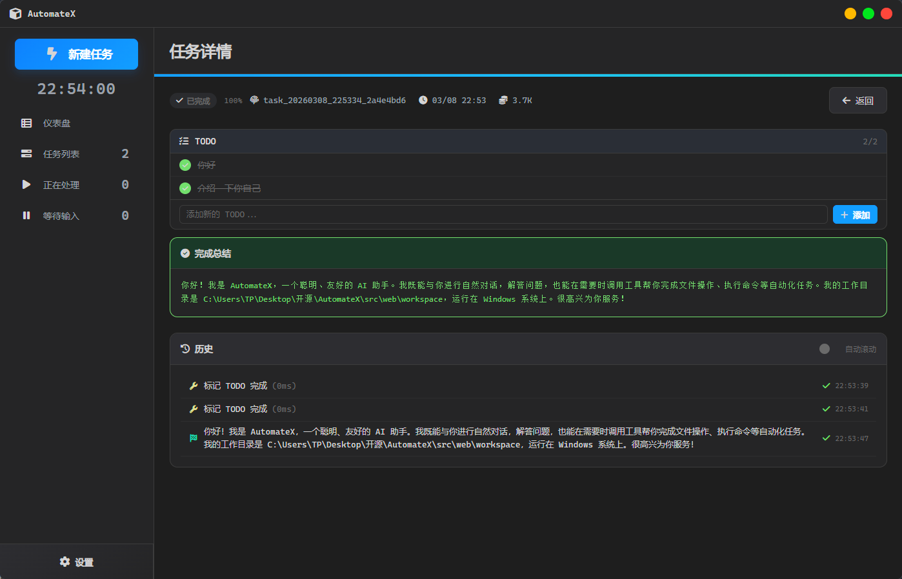
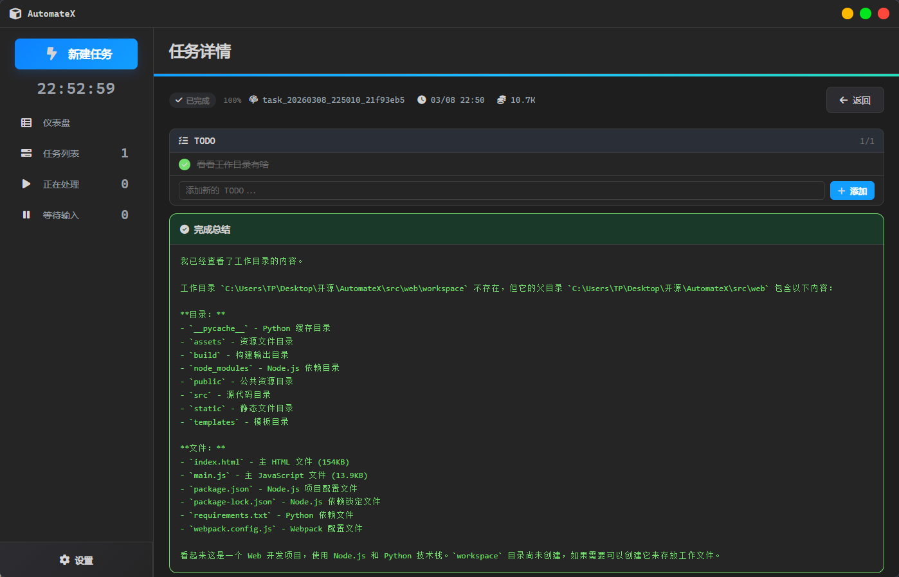

# AutomateX

<div align="center">

<h3>🚀 Windows 智能任务自动化引擎</h3>

**用自然语言驱动你的电脑，让 AI 替你完成重复工作**

[](https://python.org)
[](LICENSE)
[](https://www.microsoft.com/windows)

[**English**](README.md)

</div>

---

## ✨ 为什么选择 AutomateX？

| 传统 AI Agent | AutomateX V3 引擎 |
|--------------|------------------|
| 每次调用携带全部工具描述 | 两阶段按需注入，**节省 90% Token** |
| 单一工具格式 | 紧凑描述格式，**再省 80% Token** |
| AI 直接执行系统命令 | MCP 安全隔离，**防止危险操作** |
| 上下文无限增长 | FIFO 滑动窗口，**稳定长对话** |

## 🖼️ 界面预览

**📊 仪表盘** — 任务统计 · 快捷操作



**📋 任务详情** — 执行结果 · 实时反馈



**💬 对话历史** — AI 交互 · TODO 追踪


## 🌟 核心特性

| 特性 | 说明 |
|------|------|
| 🤖 **多模型支持** | Kimi、DeepSeek、Qwen、GPT 等 OpenAI 兼容 API |
| ⚡ **极致省钱** | V3 两阶段架构 + 紧凑格式，Token 消耗降低 **90%+** |
| 🔒 **安全隔离** | MCP Server 独立进程，危险命令自动拦截 |
| 🖥️ **开箱即用** | Electron 桌面应用，无需命令行 |
| 📝 **可定制** | 提示词外部化，轻松调整 AI 行为 |
| 🔄 **智能上下文** | FIFO 窗口管理，支持超长任务对话 |

## 📖 文档

| 文档 | 说明 |
|------|------|
| [快速入门](docs/getting-started.md) | 安装、配置、首次运行 |
| [API 接口文档](docs/api-reference.md) | REST API、WebSocket、Python API 完整参考 |
| [系统架构](docs/architecture.md) | V3 引擎、MCP Server、安全机制 |
| [部署与打包](docs/deployment.md) | Electron 打包、生产部署、故障排除 |

## 快速开始

### 1. 安装依赖

```bash
# 创建虚拟环境
python -m venv .venv
.venv\Scripts\activate

# 安装依赖
pip install -r requirements.txt
```

### 2. 配置 API Key

**方式一（推荐）：** 通过桌面应用的设置界面直接配置 API Key、Base URL 和 Model。

**方式二：** 直接编辑 `src/config/user_config.json`：

```json
{
  "api": {
    "api_key": "your-api-key-here",
    "base_url": "https://api.moonshot.cn/",
    "model": "kimi-k2-0905-preview"
  }
}
```

支持 Kimi、DeepSeek、Qwen 等 OpenAI 兼容 API。

### 3. 启动应用

**桌面应用（推荐）：**

```bash
cd src/web
npm install
npm start
```

**命令行：**

```bash
python -m src.tasks.main "创建一个名为test的文件夹"
```

**Python API：**

```python
from src.tasks import AutomateX

ax = AutomateX(model="deepseek")
task = ax.run("列出当前目录的所有文件")
```

## 项目结构

```
rabit/
├── src/
│   ├── config/              # 统一配置系统
│   │   ├── loader.py        # ConfigManager 单例配置加载器
│   │   ├── sys_config.json  # 系统配置（MCP、日志、安全策略）
│   │   └── user_config.json # 用户偏好配置（含 API Key）
│   ├── tasks/               # 任务引擎核心
│   │   ├── engine.py        # V3 两阶段工具调用引擎
│   │   ├── tools.py         # 工具定义与注册
│   │   ├── context.py       # FIFO 上下文管理
│   │   ├── mcp_client.py    # MCP 客户端（含 Local fallback）
│   │   ├── api.py           # AutomateX 高层 API
│   │   ├── models.py        # 数据模型与状态机
│   │   ├── store.py         # 任务持久化（JSON 原子写入）
│   │   ├── scheduler.py     # 任务调度器
│   │   ├── main.py          # CLI 入口
│   │   ├── config.py        # 配置兼容层
│   │   ├── chat/            # AI 接口封装（OpenAI 兼容 API）
│   │   ├── prompt/          # 提示词模板
│   │   ├── messages/        # 任务消息历史（运行时生成）
│   │   └── examples/        # 使用示例
│   ├── mcp/                 # MCP Server（工具执行服务）
│   │   ├── server.py        # JSON-RPC 2.0 服务器
│   │   ├── cli.py           # 命令行工具（Click + Rich）
│   │   ├── sdk.py           # Python 客户端 SDK
│   │   ├── core/            # 核心模块
│   │   │   ├── security.py  # 路径安全 & 命令过滤
│   │   │   ├── cache.py     # 多层缓存策略
│   │   │   ├── config.py    # Pydantic 配置模型
│   │   │   └── exceptions.py # 统一异常体系
│   │   └── modules/         # 工具模块
│   │       ├── read/        # 文件读取、目录列表
│   │       ├── search/      # 文件名 & 内容搜索
│   │       ├── edit/        # 文件 CRUD & 内容编辑
│   │       └── execute/     # 进程管理 & 命令执行
│   └── web/                 # Electron 桌面应用
│       ├── index.html       # 前端界面（单页应用）
│       ├── main.js          # Electron 主进程
│       ├── preload.js       # 预加载安全桥接
│       ├── server.py        # FastAPI 后端服务
│       ├── ws_manager.py    # WebSocket 连接管理
│       ├── assets/          # 静态资源（图标等）
│       ├── scripts/         # 构建脚本
│       └── build/           # 嵌入式 Python 运行时
├── docs/                    # 项目文档
│   ├── api-reference.md     # REST API 接口文档
│   ├── architecture.md      # 系统架构说明
│   ├── getting-started.md   # 快速入门指南
│   ├── deployment.md        # 部署与打包指南
│   └── message_flow.drawio  # 消息流程图
├── .dev/                    # 开发资料（不纳入发布）
│   ├── core.drawio          # 核心架构图
│   └── key.json             # 个人备忘录
├── requirements.txt         # Python 依赖
└── README.md                # 本文档
```

## 架构说明

### V3 两阶段工具调用

```
┌─────────────────────────────────────────────────────────────┐
│                        任务引擎 V3                           │
├─────────────────────────────────────────────────────────────┤
│  Phase 1: SELECT                                            │
│  ┌─────────────┐    ┌─────────────┐    ┌─────────────┐     │
│  │ 用户任务    │ -> │ AI 选择工具  │ -> │ 工具列表    │     │
│  │ (简短描述)  │    │ (仅名称)     │    │ ["read_file"] │   │
│  └─────────────┘    └─────────────┘    └─────────────┘     │
├─────────────────────────────────────────────────────────────┤
│  Phase 2: PARAMS                                            │
│  ┌─────────────┐    ┌─────────────┐    ┌─────────────┐     │
│  │ 工具说明    │ -> │ AI 填参数    │ -> │ 执行调用    │     │
│  │ (精简格式)  │    │ {"call":...} │    │ MCP/Local   │     │
│  └─────────────┘    └─────────────┘    └─────────────┘     │
└─────────────────────────────────────────────────────────────┘
```

**优势：**
- 阶段1仅传工具名称列表，不传详细描述
- 阶段2仅注入被选中工具的说明
- 上下文使用 FIFO 滑动窗口，避免无限增长

### MCP Server

MCP (Model Context Protocol) Server 提供安全隔离的工具执行环境：

- **JSON-RPC 2.0** 通信协议，支持 TCP / stdio 两种模式
- **路径安全验证**：工作区范围校验 + 系统路径阻止 + 符号链接检测
- **命令安全过滤**：15+ 危险模式正则检测（递归删除、格式化、注册表操作等）
- **多层缓存**：文件元数据(60s) / 目录列表(30s) / 搜索结果(5min) 独立 TTL
- **独立进程**，与主应用完全隔离
- **Python SDK**（`sdk.py`）提供完整的异步客户端封装
- **Rich CLI**（`cli.py`）支持交互式调试和服务管理

## 可用工具

| 类别 | 工具 | 说明 |
|------|------|------|
| 读取 | `read_file` | 读取文件内容 |
| 读取 | `list_dir` | 列出目录内容 |
| 读取 | `exists` | 检查路径是否存在 |
| 搜索 | `search_files` | 按文件名搜索 |
| 搜索 | `search_content` | 在文件内容中搜索 |
| 编辑 | `write_file` | 写入文件 |
| 编辑 | `create_dir` | 创建目录 |
| 编辑 | `delete` | 删除文件或目录 |
| 编辑 | `move` | 移动/重命名 |
| 编辑 | `copy` | 复制文件 |
| 执行 | `run` | 执行命令 |
| 控制 | `done` | 完成任务 |
| 控制 | `fail` | 任务失败 |
| 控制 | `ask` | 询问用户 |

## 自定义提示词

编辑 `src/tasks/prompt/select.md` 可自定义 AI 的行为。支持的变量：

- `{cwd}` - 当前工作目录
- `{tool_list}` - 可用工具列表

## 配置说明

配置文件位于 `src/config/` 目录，采用统一配置管理系统：

**用户配置** `user_config.json`（含 API 配置）：
```json
{
  "workspace": {
    "default_working_directory": ""
  },
  "ui": {
    "auto_scroll": true
  },
  "task": {
    "max_iterations": 50
  },
  "api": {
    "api_key": "your-api-key",
    "base_url": "https://api.moonshot.cn/",
    "model": "kimi-k2-0905-preview"
  }
}
```

**系统配置** `sys_config.json`：
```json
{
  "mcp": { "server": { "host": "localhost", "port": 8080 } },
  "tasks": { "engine": { "backend": "v3" } },
  "logging": { "level": "INFO" }
}
```

使用 `ConfigManager` 统一访问所有配置：
```python
from src.config import config

api_key = config.user.api_key
model = config.user.model
config.save_user_config()
```

## API 文档

### AutomateX 类

```python
from src.tasks.api import AutomateX

# 初始化（AI 模型从 user_config.json 自动读取）
ax = AutomateX(
    working_directory="./",     # 工作目录
    use_mcp=True,               # 是否使用 MCP Server
    show_reasoning=False        # 是否显示思考过程
)

# 运行任务
task = ax.run("任务描述")

# 交互式运行（遇到需要输入时从控制台获取）
task = ax.run_interactive("任务描述")

# 创建任务（不立即执行）
task = ax.create_task("任务描述")

# 继续执行任务（支持提供用户输入）
task = ax.continue_task("task_id", user_input="回答")

# 查看任务列表
tasks = ax.list_tasks()

# 获取任务状态
task = ax.get_task("task_id")

# 重试失败的任务
ax.retry_task("task_id")

# 取消任务
ax.cancel_task("task_id")

# 清理旧任务
ax.cleanup(days=30)

# 获取统计信息
stats = ax.get_statistics()
```

### 快捷函数

```python
from src.tasks.api import quick_run, interactive_run

# 快速运行
task = quick_run("创建 test.txt 文件")

# 交互式运行
task = interactive_run("整理当前目录")
```

## 开发

### MCP Server 开发

```bash
# 启动 MCP Server（TCP 模式）
python -m src.mcp --port 8080

# 使用 CLI 交互式测试
python -m src.mcp interactive --host 127.0.0.1 --port 8080
```

### Web UI 开发

```bash
cd src/web
npm install
npm run dev      # 开发模式（启用 DevTools）
npm start        # 正式启动
npm run build:win  # 打包 Windows 安装程序
```

### 运行示例

```bash
python -m src.tasks.examples.examples
```

### 项目依赖

- **Python**: >= 3.10，核心依赖见 `requirements.txt`
- **Node.js**: >= 18.0.0，用于 Electron 桌面应用
- **AI API**: 支持 Kimi / DeepSeek / Qwen 等 OpenAI 兼容 API

## 许可证

MIT License

## 贡献

欢迎提交 Issue 和 Pull Request！
